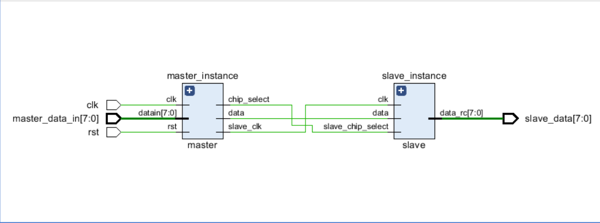

# SPI_Protocol
# Overview
This project demonstrates the implementation of Serial Peripheral Interface (SPI) communication using Verilog. It includes a simple SPI master and SPI slave module that communicate with each other. The master sends data to the slave, which receives and stores it. The project includes the Verilog code for both the master and slave modules, along with a testbench to simulate and verify their functionality.

# SPI Protocol
SPI is a synchronous serial communication protocol used for short-distance communication, primarily in embedded systems. It involves a master device and one or more slave devices. Communication is based on four signals:

MOSI (Master Out Slave In): Line used by the master to send data to the slave.
SCLK (Serial Clock): Line used by the master to provide the clock signal to synchronize data transmission.
SS/CS (Slave Select/Chip Select): Line used by the master to select a specific slave device.

# Simulation Output

# Generated Schematic
